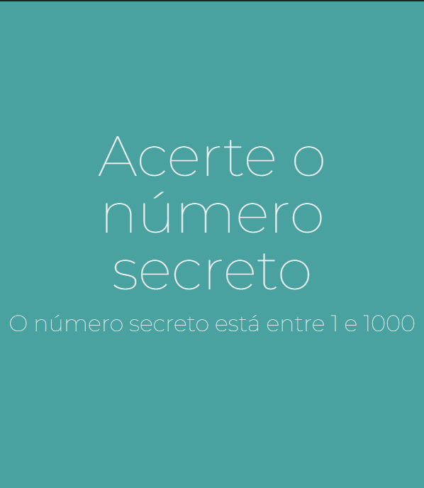

<h1 align="center"> NÚMERO SECRETO </h1>

Jogo feito ao acompanhar as aulas de JavaScript do curso alura

  <a href="#-tecnologias">Tecnologias</a>&nbsp;&nbsp;&nbsp;|&nbsp;&nbsp;&nbsp;
  <a href="#-projeto">Projeto</a>&nbsp;&nbsp;&nbsp;|&nbsp;&nbsp;&nbsp;
  <a href="#memo-licença">Licença</a>

  

 

  

## 🚀 Tecnologias

Esse projeto foi desenvolvido com as seguintes tecnologias:

- HTML e CSS
- JavaScript
- Git e Github

## 💻 Projeto

O NÚMERO SECRETO é um jogo desenvolvido para se divertir em família

## :memo: Licença

Esse projeto está sob a licença MIT.

---

Feito com ♥ by Arthur Oliveira
